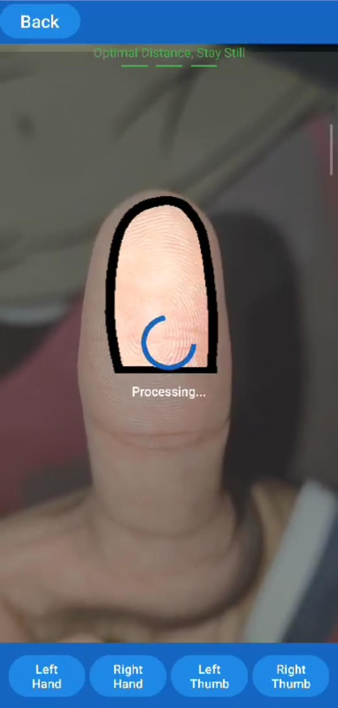

# Touchless Fingerprint Recognition

Touchless Fingerprint is an Android-based application designed to capture and recognize fingerprints without the need for physical contact. Leveraging the camera of the device, this project aims to provide a hygienic and non-intrusive method for fingerprint recognition, suitable for diverse applications like security systems, identity verification, and attendance tracking.

## Features

- **Touchless Fingerprint Capture:** Uses the device's camera to capture fingerprint images.
- **Image Processing:** Processes and enhances the captured fingerprint images for better recognition.
- **Fingerprint Matching:** Matches the captured fingerprint against a database of stored fingerprints.
- **Hygienic & Non-Intrusive:** Eliminates the need for physical contact with traditional fingerprint scanners.

## Requirements

- **Android Studio:** For running and building the application.
- **Android Device:** Minimum API level 21 (Android 5.0 Lollipop) with a working camera.

## Installation

1. Clone the repository:
   ```bash
   git clone https://github.com/hasanatlodhi/TouchlessFingerPrint.git
   ```
2. Open the project in Android Studio.
3. Build the project and resolve any dependencies.
4. Deploy the application to an Android device or emulator.

## Usage

1. Launch the application on your Android device.
2. Follow the on-screen instructions to position your finger or thumb in front of the camera.
3. Capture the fingerprint image.
4. The application will process the image and extract fingerprints

## DEMO




